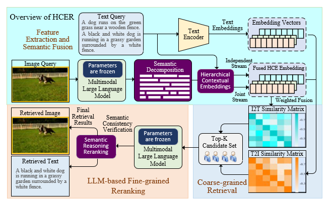

# HCER: Hierarchical Contextual Embeddings and Re-ranking for Training Free Cross-Modal Retrieval
HCER: Hierarchical Contextual Embeddings and Re-ranking for Training-Free Cross-Modal Retrieval

## Abstract

Generation-based training-free cross-modal retrieval leverages Multimodal Large Language Models (MLLMs) to map images into textual descriptions for unified matching. However, holistic embeddings often dilute fine-grained visual features due to semantic redundancy, the sparse distribution of atomic-level semantics within long sequences, and the inability of cosine similarity to verify complex cross-modal consistency. 

To overcome these limitations, we propose **HCER (Hierarchical Contextual Embeddings and Re-ranking)**, a fully training-free framework following a **"Decomposition-Hierarchy-Verification"** paradigm. 
1. **Decomposition**: Utilizes frozen MLLMs with structured prompts to transform visual inputs into multi-perspective textual descriptions, extracting explicit atomic-level semantic units. 
2. **Hierarchy**: Introduces Hierarchical Contextual Embeddings (HCE), which decouples these descriptions into an independent stream for local discriminative power and a joint stream for global contextual coherence, fusing them to prevent detail dilution. 
3. **Verification**: Employs an MLLM-based Semantic Consistency Reasoning Re-ranking module to perform explicit logical validation on Top-K candidates, moving beyond surface-level statistical similarity. 

Extensive experiments on **Flickr30K** and **MSCOCO** demonstrate that HCER significantly improves zero-shot retrieval performance, particularly in Recall@1, proving the efficacy of integrating atomic-level semantics with explicit reasoning without task-specific optimization.

---

## Framework

The project follows a **"Decomposition-Hierarchy-Verification"** paradigm, which consists of the following core steps:

*Fig. 1: Overall architecture of the HCER framework.*

- **Semantic Decomposition**: Utilizes structured prompts to transform images into multi-view, atomic-level semantic descriptions.
- **Hierarchical Contextual Embeddings (HCE)**: Mitigates semantic dilution in long descriptive sequences by effectively fusing local discriminative power with global contextual coherence.
- **Reasoning-based Re-ranking**: Leverages Multimodal Large Language Models (MLLMs) to perform explicit logical consistency verification on Top-K candidates.

---

## Experimental Results

### 1. Performance Comparison on Flickr30K
On the Flickr30K dataset, HCER achieves state-of-the-art performance across multiple metrics, particularly in R@1.

| Method | I2T R@1 | I2T R@5 | I2T R@10 | T2I R@1 | T2I R@5 | T2I R@10 |
| :--- | :---: | :---: | :---: | :---: | :---: | :---: |
| CLIP (ViT-L) | 87.2 | 98.3 | 99.4 | 67.3 | 89.0 | 93.3 |
| BLIP (ViT-L) | 75.5 | 95.1 | 97.7 | 70.0 | 91.2 | 95.2 |
| VL-DE (2024) | 83.7 | 96.7 | 99.0 | 65.3 | 88.8 | 93.1 |
| D2E-VSE (2025) | 84.1 | 96.1 | 98.3 | 68.5 | 91.3 | 94.9 |
| E5V (2024) | 88.2 | 98.7 | 99.4 | 79.5 | **95.0** | **97.6** |
| WaveDN (2024)* | 82.3 | 96.3 | 97.8 | 63.7 | 87.2 | 93.0 |
| ImageScope (2025)* | 81.1 | 94.0 | 96.8 | - | - | - |
| LexiCLIP (2025)* | 92.9 | - | 97.1 | 79.2 | - | 97.4 |
| **HCER (Ours)** | **96.5** | **99.0** | **99.7** | **83.0** | 91.7 | 95.3 |

### 2. Performance Comparison on MSCOCO
On the MSCOCO (5K test set), HCER demonstrates superior zero-shot retrieval capabilities.

| Method | I2T R@1 | I2T R@5 | I2T R@10 | T2I R@1 | T2I R@5 | T2I R@10 |
| :--- | :---: | :---: | :---: | :---: | :---: | :---: |
| CLIP (ViT-L) | 58.1 | 81.0 | 87.8 | 37.0 | 61.6 | 71.5 |
| BLIP (ViT-L) | 63.5 | 86.5 | 92.5 | 48.4 | 74.4 | 83.2 |
| VL-DE (2024) | 63.4 | 87.6 | **93.7** | 46.5 | 75.3 | 84.9 |
| D2E-VSE (2025) | 60.6 | 86.5 | 93.2 | 46.8 | 76.4 | **85.7** |
| E5V (2024) | 62.0 | 83.6 | 89.7 | 52.0 | **76.5** | 84.7 |
| WaveDN (2024)* | 50.9 | 75.4 | 83.7 | 31.4 | 56.5 | 67.6 |
| ImageScope (2025)* | 53.7 | 75.9 | 83.5 | - | - | - |
| LexiCLIP (2025)* | 67.4 | - | 92.1 | 52.7 | - | 84.5 |
| **HCER (Ours)** | **75.5** | **88.1** | 92.9 | **54.4** | 68.5 | 77.6 |

*\*Note: '*' indicates training-free models.*

---

## 开源声明 (Availability)

**The source code will be made publicly available upon the acceptance of the paper.**
